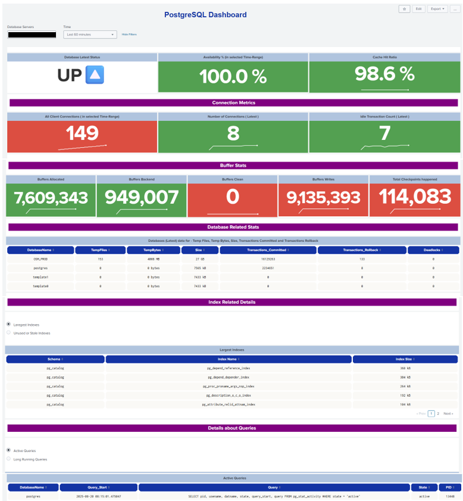
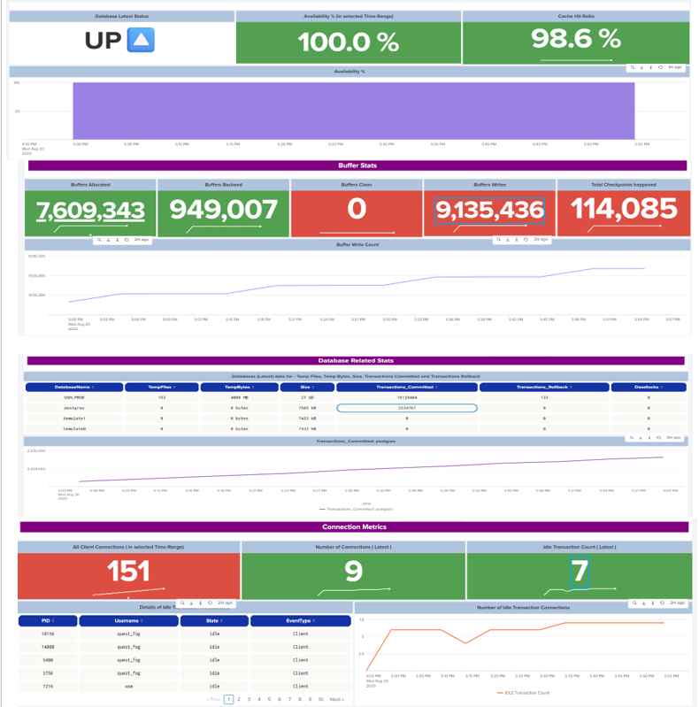

## 📊 How to Monitor PostgreSQL from Splunk

We can monitor PostgreSQL databases in Splunk using the **Splunk DB Connect** add-on.  
Follow the steps below to configure monitoring.

---

### ✅ Step 1: Create a Read-Only User in PostgreSQL

### ✅ Step 2: Make sure 5432 Port is open from your Splunk to Posgres DB.

### ✅ Step 3: Create an index in Splunk something like "postgres_dev_events" or "postgres_prod_events"

### ✅ Step 4: Create Inputs in "Splunk DB Connect" App and run every 5 mins. [Postgres_Input](Postgres_Input.md)

### ✅ Step 5: Create a Dashboard in Splunk [Postgres_Dashboard](Postgres_Dashboard.txt)

- We can see Trends for selected timerange for each item -
- 

- Check the Complete Dashboard [Postgres Dashboard](Postgres_Dashboard.pdf)
---
